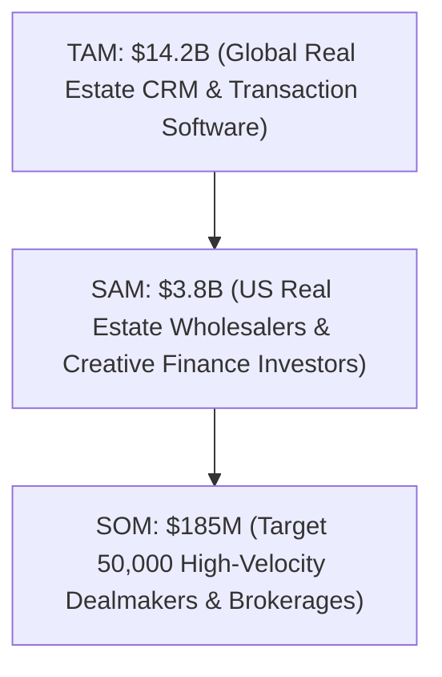
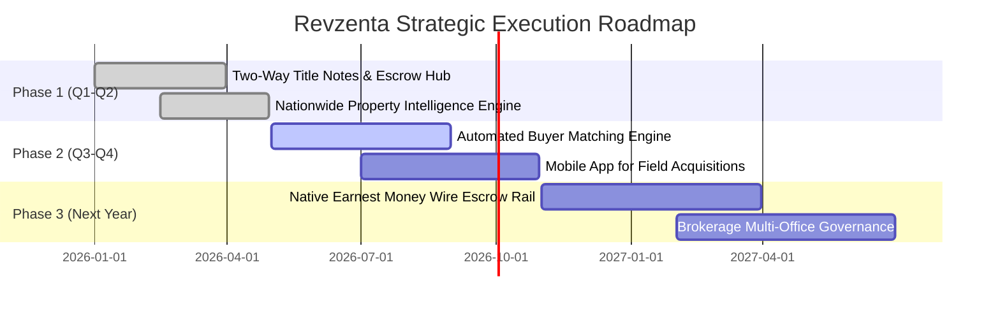

# Revzenta (Revzenta CRM) — Comprehensive Business Plan
**Next-Generation Deal Intelligence & Transaction Coordination Operating System for Real Estate Wholesalers & Creative Finance Investors**

*CONFIDENTIAL — PREPARED FOR INVESTORS & STRATEGIC PARTNERS*

---

## 1. Executive Summary

### 1.1 Company Overview
**Revzenta** is a vertical SaaS and deal intelligence platform purpose-built for real estate wholesalers, creative finance investors (Subject-To, Seller Finance), and high-velocity acquisitions teams. 

Unlike generic CRMs (Salesforce, HubSpot) that require months of custom configuration, or legacy real estate tools (Podio, REI Reply) that are brittle and fragmented, Revzenta unites the entire real estate acquisitions lifecycle into a single operating system:
1. **AI Property Ingestion & Distress Intelligence**: Live scans across national distress motivations (vacant, pre-foreclosure, tax liens, probate, absentee owners) with the proprietary **Revzenta Opportunity Score**.
2. **Precision Creative Finance Underwriting**: Automated multi-strategy underwriting engines for Cash Offers (70% MAO rule), Wholesale Assignment fees, Seller Financing, and Subject-To wrap mortgages.
3. **Legally Binding Transaction Hub**: State-specific Purchase and Sale Agreements (PSA), Assignment contracts with equitable interest clauses, and live contingency countdown clocks.
4. **Standalone Title & Escrow Coordination Portal**: Secure, zero-knowledge cryptographic magic links (`/title-portal/:token`) enabling title companies to track milestones, download contract packets, and conduct two-way closing coordination without requiring an account or seat.

### 1.2 Mission & Vision
- **Mission**: To empower real estate dealmakers to find, underwrite, contract, and close off-market property transactions faster and with lower legal and operational risk.
- **Vision**: To become the financial and closing infrastructure backbone for the \$2.4T off-market residential and commercial transaction ecosystem.

---

## 2. Problem & Market Opportunity

### 2.1 The Problem: A Broken, Fragmented $14B Tech Stack
Off-market real estate investors operate under intense time pressure and high legal scrutiny. Their current workflow is crippled by fragmentation:
1. **Data Silos**: Investors subscribe to 4–6 disconnected tools (PropStream for data, BatchLeads for skip tracing, Podio for pipeline, DocuSign for contracts, and email/SMS for title communication).
2. **Missed Contingency Deadlines**: Earnest Money Deposit (EMD) deadlines and inspection contingencies slip through the cracks, leading to forfeited deposits and litigation.
3. **Escrow Communication Black Hole**: Title companies refuse to log into investor CRMs. Coordination happens through unencrypted emails and fragmented phone calls, creating severe vulnerability to wire redirection fraud and closing delays.
4. **Privacy & Data Security Vulnerabilities**: Generic CRMs lack zero-knowledge isolation, leaving proprietary buyer lists and confidential wholesale spreads exposed.

### 2.2 Market Size (TAM, SAM, SOM)
- **Total Addressable Market (TAM) — \$14.2 Billion**:
  - Global Real Estate CRM and Transaction Management software market, growing at 11.4% CAGR (2025–2032).
- **Serviceable Addressable Market (SAM) — \$3.8 Billion**:
  - US Residential Real Estate Investors, Wholesalers, Creative Finance Dealmakers, and Independent Brokerages (approx. 420,000 active real estate investing entities and small brokerages in North America).
- **Serviceable Obtainable Market (SOM) — \$185 Million**:
  - Initial 5-year capture target representing ~50,000 active subscribers operating off-market wholesaling and creative acquisitions.



---

## 3. Product & Technological Moat

Revzenta combines multi-tenant enterprise software engineering with native real estate workflows:

### 3.1 Proprietary Modules & Architecture
| Module | Technical Capability | Competitive Differentiator |
| :--- | :--- | :--- |
| **Transaction Hub & E-Signature** | Native HTML-to-PDF rendering (`pdf-lib`), state-specific compliance clauses (TX, FL, CA, GA, NC, AZ), and audit-trailed electronic signatures. | Eliminates expensive DocuSign/PandaDoc licenses; contracts auto-populate deal terms and legal disclaimers. |
| **Title & Escrow Coordination Portal** | Public cryptographic token links (`/title-portal/:token_hash`), visual 5-stage progress tracker, and two-way escrow notes. | **Zero friction for Title Companies**: Escrow officers require zero login or paid seat. Updates sync in real time. |
| **Wire Fraud & Legal Shield** | Mandatory ALTA/FTC wire fraud warnings, GLBA non-public financial info notices, and immutable audit logs. | Reduces liability of wire redirection fraud during closing coordination. |
| **AI Deal Ingestion & Distress Monitor** | Background monitoring engine polling national property providers (RentCast, Attom Data, Cotality), Gemini AI natural language search translation. | Converts unstructured investor queries (*"vacant in Phoenix with >40% equity"*) into structured pipeline leads with automated distress alerts. |
| **Zero-Knowledge Multi-Tenant Privacy** | Strict SQL multi-tenant scoping (`org_id` isolation), masking sensitive pipeline volumes and financial records. | Absolute privacy: No cross-tenant data leaks, preserving dealmaker trade secrets. |

---

## 4. Business & Monetization Model

Revzenta operates a high-margin, recurring B2B SaaS model supplemented by data credit consumption:

### 4.1 Subscription Tiers
```
+--------------------------+--------------------------+--------------------------+
|  Starter Wholesaler      |   Pro Dealmaker (Hero)   |   Scale & Brokerage      |
|  $24.99 / month          |   $59.99 / month         |   $79.00 / month         |
+--------------------------+--------------------------+--------------------------+
| - Inbound Lead Pipeline  | - Everything in Starter  | - Everything in Pro      |
| - Standard CRM Stages    | - Wholesale Hub & PSA    | - 5 Included Team Seats  |
| - Basic Deal Calculator  | - Title Escrow Portal    | - Automated Distress Bot |
| - Email Support          | - E-Signatures & Clocks  | - Brokerage Analytics    |
|                          | - Live Escrow Notes      | - Dedicated Priority SLA |
+--------------------------+--------------------------+--------------------------+
```
*(Custom Brokerage / Enterprise packages offered from \$200 – \$499/mo for large disposition desks requiring custom integrations and dedicated database instances).*

### 4.2 Expansion Revenue Streams
1. **Property Data & Skip-Tracing Credits**: \$0.10 to \$0.15 per skip trace / automated property title lien lookup.
2. **AI Underwriting Volume Add-ons**: High-volume automated underwriting API credits for institutional disposition funds.
3. **Escrow Document Verification Services**: Premium title packet assembly and automated payoff verification.

---

## 5. Unit Economics & Financial Projections

### 5.1 Unit Economics (Pro Tier Baseline)
- **Blended ARPU (Average Revenue Per User)**: \$68.50 / month (\$822 / year)
- **Customer Acquisition Cost (CAC)**: \$145.00 (Blended across organic, community, and paid)
- **Gross Margin**: **84.5%** (Hosted on efficient Node/Bun + Postgres cloud infrastructure)
- **Monthly Churn Rate**: **3.2%** (Targeting < 2.5% at scale due to transaction hub workflow lock-in)
- **Customer Lifetime Value (LTV)**: \$1,805.00
- **LTV : CAC Ratio**: **12.4x** (World-class SaaS benchmark is > 3.0x)
- **CAC Payback Period**: **2.1 Months**

### 5.2 3-Year Financial Forecast


| Metric | Year 1 (Launch & Scale) | Year 2 (Growth & Expansion) | Year 3 (Market Leadership) |
| :--- | :--- | :--- | :--- |
| **Active Subscribers** | 1,200 | 4,800 | 14,500 |
| **Monthly Recurring Revenue (MRR)** | \$82,000 | \$328,000 | \$995,000 |
| **Annual Recurring Revenue (ARR)** | **\$984,000** | **\$3,936,000** | **\$11,940,000** |
| **Cost of Goods Sold (COGS - 16%)** | \$157,440 | \$629,760 | \$1,910,400 |
| **Gross Profit** | **\$826,560** | **\$3,306,240** | **\$10,029,600** |
| **R&D & Engineering** | \$320,000 | \$850,000 | \$1,900,000 |
| **Sales & Marketing** | \$280,000 | \$950,000 | \$2,800,000 |
| **G&A / Legal / Compliance** | \$95,000 | \$220,000 | \$550,000 |
| **EBITDA** | **+\$131,560** | **+\$1,286,240** | **+\$4,779,600** |
| **EBITDA Margin** | **13.4%** | **32.7%** | **40.0%** |

---

## 6. Go-To-Market (GTM) Strategy

### 6.1 Product-Led Growth (PLG) & The "Title Viral Loop"
- Whenever a subscriber sends a contract to an escrow officer or closing attorney, the title company accesses the **Title & Escrow Portal** (`/title-portal/:token`).
- Every escrow officer and title company encounters Revzenta’s streamlined settlement UI.
- Escrow officers handle dozens of transactions for different local real estate investors weekly. Revzenta includes an invitation banner for title officers to invite their other investor clients, generating zero-CAC inbound subscriber viral loops.

### 6.2 Community & Influencer Partnerships
- Partnering with prominent real estate mentorship programs and creative finance communities (SubTo, Wholesale Hotline, AstroFlipping, BiggerPockets).
- Offering pre-configured deal workflows and state-specific legal templates co-branded with leading real estate educators.

### 6.3 Performance Marketing & SEO
- Targeted search campaigns capturing high-intent search terms (*"real estate wholesale CRM"*, *"subject-to deal calculator"*, *"assignment contract software"*, *"escrow closing software"*).
- Free programmatic underwriting calculators and state contract generators acting as top-of-funnel lead magnets.

---

## 7. Legal, Regulatory & Risk Management

1. **Wire Fraud Indemnification & Advisory Safeguards**:
   - Comprehensive, permanent ALTA-compliant wire fraud warnings placed across all public and authenticated communication touchpoints.
2. **E-SIGN & UETA Compliance**:
   - Cryptographic timestamping, IP address capture, and certificate of completion generated for all executed contracts adhering to the federal Electronic Signatures in Global and National Commerce Act.
3. **State Wholesaling Disclosures (Equitable Interest Laws)**:
   - Built-in required statutory disclosures for jurisdictions regulating wholesaling (e.g., Texas Property Code § 5.086, Arizona SB 1494, and Florida assignment rules) protecting subscribers from unlicensed brokerage infractions.
4. **Data Sovereignty & Multi-Tenant Security**:
   - Strict row-level security and automated daily database backups with zero-knowledge data isolation.

---

## 8. Milestone Roadmap


