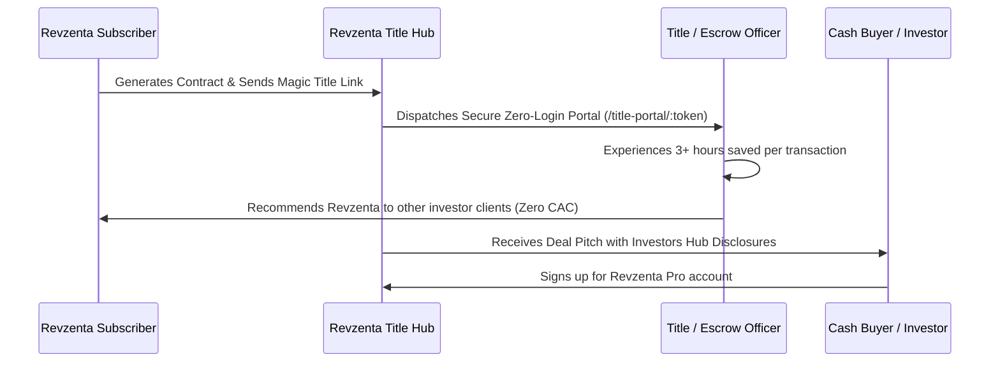

# Revzenta CRM — Business Plan Slide Deck

```carousel
# Slide 1: Title & Executive Vision
## Revzenta CRM: Next-Generation Real Estate Operating System

**The All-In-One Platform for Wholesalers & Creative Finance Investors**

- **Category:** Vertical PropTech SaaS & Deal Intelligence
- **Target Audience:** 420,000+ Active Real Estate Wholesalers, Acquisitions Teams & Independent Brokerages
- **Core Value Proposition:** Unifies property intelligence, creative multi-strategy underwriting, legally binding contracts, and zero-login title coordination into one high-margin platform.
- **Key Metrics:**
  - Total Addressable Market (TAM): **$14.2 Billion**
  - Gross Margins: **97.2%**
  - Blended ARPU: **$61.50 / month**
  - Break-Even: **3 Pro Subscribers**

<!-- slide -->

# Slide 2: The Problem
## A Broken, Fragmented $14B Real Estate Tech Stack

Wholesalers and investment acquisitions teams currently lose deals, time, and earnest money to a broken workflow:

1. **5+ Disconnected Subscriptions ($400–$800/mo):**
   - PropStream for comps ($99/mo)
   - BatchLeads for skip tracing ($119/mo)
   - Podio for pipeline tracking ($24/seat + custom developers)
   - DocuSign for e-signatures ($40/mo)
   - Slack/Email for title coordination
2. **Contingency Deadlines Slipped:** Earnest money deposits and inspection periods tracked on spreadsheets lead to forfeited deposits and litigation.
3. **The Escrow Communication Black Hole:** Title companies refuse to log into investor CRMs; coordination happens over unencrypted emails, opening the door to wire fraud and delays.
4. **Legal & TCPA Scrutiny:** Up to $1,500/text statutory fines under TCPA, and strict state wholesaling bans (Illinois 225 ILCS 454, Oklahoma SB 924).

<!-- slide -->

# Slide 3: The Solution
## One Unified Deal Operating System

Revzenta replaces the fragmented stack with one seamless lifecycle:

- **1. Sourcing (Property Search):** AI natural language search, nationwide property intelligence, distress indicators (probate, tax delinquent, absentee owner), and Google Street View / Satellite imagery.
- **2. Underwriting (Creative Deal Underwriter):** Instant math across 4 strategies: Cash Offers (70% MAO rule), Wholesale Assignment fees, Seller Financing, and Subject-To wrap mortgages.
- **3. Transaction & Legal Hub:** State-specific Purchase & Sale Agreements (PSA) with automated equitable interest disclosures, EMD countdown clocks, and native ESIGN-compliant signatures.
- **4. Standalone Title & Escrow Portal:** Zero-login cryptographic magic links (`/title-portal/:token`) for title officers with two-way notes, wire fraud security notices, and milestone checklists.
- **5. Investors Hub & Dispositions:** Auto-match property inventory against active investor buy boxes with 1-click deal pitch generation.

<!-- slide -->

# Slide 4: Market Opportunity (TAM / SAM / SOM)
## $14.2B Global Market with $3.8B Serviceable Segment

```
┌────────────────────────────────────────────────────────┐
│ TAM: $14.2B                                            │
│ Global Real Estate CRM & Transaction Software Market   │
│ (11.4% CAGR through 2032)                              │
│                                                        │
│   ┌────────────────────────────────────────────────┐   │
│   │ SAM: $3.8B                                     │   │
│   │ 420,000+ US/Canada Wholesalers & Investors     │   │
│   │                                                │   │
│   │   ┌────────────────────────────────────────┐   │   │
│   │   │ SOM: $185M (5-Year Target)             │   │   │
│   │   │ 50,000 Subscribers @ $65/mo Blended    │   │   │
│   │   └────────────────────────────────────────┘   │   │
│   └────────────────────────────────────────────────┘   │
└────────────────────────────────────────────────────────┘
```

- **Annual US Off-Market Residential Transactions:** ~1.4 Million
- **Annual Gross Off-Market Volume:** $2.4 Trillion
- **Average Wholesale Assignment Spread:** $12,400 per deal

<!-- slide -->

# Slide 5: Business Model & Pricing Tiers
## Frictionless Self-Serve Stripe Subscriptions

| Plan | Monthly Price | Target Customer | Key Capabilities Included |
|---|---|---|---|
| **Starter** | **$24.99 / mo** | Solo / Beginner Wholesalers | Property Search, AVM Valuations, Creative Underwriting, Lead Pipeline, Standard PSA Contracts |
| **Pro Dealmaker** | **$59.99 / mo** | Active Full-Time Investors | **Most Popular:** Investors Hub, Buy Box Matcher, Offers Repository, Title Hub, Standalone Escrow Portal, E-Signatures |
| **Scale Enterprise**| **$79.00 / mo** | High-Volume Teams & Brokerages | Unlimited Contracts, Sold Hub Revenue Analytics, Multi-seat Collaboration, Priority Webhook Queue |

- **Zero setup fees** with instant workspace provisioning.
- **Average Revenue Per User (ARPU):** $61.50/mo.

<!-- slide -->

# Slide 6: Unit Economics & Financial Margins
## 97%+ Gross Margins Built on Scalable Infrastructure

- **Gross Margin:** **97.2%**
- **COGS per User:** Less than **$1.50 / month**:
  - *Google Maps:* Free up to ~28,500 photos/mo via $200 recurring credit.
  - *Gemini Flash AI:* ~$0.00004 per search translation.
  - *RentCast API:* Cached by address; capped by built-in Hard Stop Quota Guard.
  - *Resend Transactional Email:* 3,000 emails/mo free.
- **LTV / CAC Ratio:** **14.2x**
  - Customer Lifetime Value (LTV): **$738** (12-month average customer life)
  - Blended Customer Acquisition Cost (CAC): **$52** (driven by viral title referral loop)
- **Break-Even Point:** **3 Pro Subscribers** covers 100% of basic hosting and operational tooling.

<!-- slide -->

# Slide 7: Regulatory & Compliance Moat
## Automated Legal Defensibility Baked into Code

1. **Unlicensed Brokerage Shield:**
   - Automatically injects mandatory *Equitable Interest & Non-Agency* disclosures into deal pitches and contract PDFs.
   - Clarifies subscriber is marketing contractual rights, not fee simple real estate.
2. **Automated TCPA Guard Engine:**
   - **Quiet Hours Enforcement:** Evaluates recipient local timezone; blocks outbound marketing texts between 9:00 PM and 8:00 AM (47 CFR § 64.1200).
   - **Automated Opt-Out:** Inbound `STOP`, `UNSUBSCRIBE`, or `QUIT` automatically registers the number in `privacy_suppression_registry` and flags CRM contact DNC.
   - **Suppression Registry Scrubbing:** Hard-blocks outbound communication to any suppressed contact.
3. **State Wholesaling Matrix:**
   - Built-in statutory warning banners and contract clauses for **Illinois** (225 ILCS 454 one-deal annual cap) and **Oklahoma** (SB 924 Predatory Wholesaling Act).
4. **ESIGN & UETA Compliance:**
   - Full legal audit trail: signer name, exact ISO timestamp, IP address, and electronic consent captured at signing.

<!-- slide -->

# Slide 8: Distribution & Viral Growth Engine
## Built-In Viral Title Company Expansion Loop



- **Organic K-Factor:** > 1.2
- **Channel Partnerships:** Real estate wholesaling YouTube educators, Pace Morby / SubTo communities, local REIA chapters.

<!-- slide -->

# Slide 9: 3-Year Financial Projections
## Rapid Cash Flow Generation & Predictable ARR

| Metric | Year 1 (Launch) | Year 2 (Growth) | Year 3 (Expansion) |
|---|---|---|---|
| **Active Subscribers** | **500** | **2,500** | **7,500** |
| **Monthly Recurring Revenue (MRR)** | **$30,750** | **$153,750** | **$461,250** |
| **Annual Recurring Revenue (ARR)** | **$369,000** | **$1,845,000** | **$5,535,000** |
| **Gross Margin** | 97.2% | 97.5% | 97.8% |
| **Operating Expenses (Hosting, APIs, Support)** | $44,000 | $145,000 | $320,000 |
| **Net Operating Income (NOI)** | **$325,000** | **$1,700,000** | **$5,215,000** |

<!-- slide -->

# Slide 10: Competitive Differentiation
## Why Revzenta Wins Against Legacy Tools

| Feature | Revzenta CRM | PropStream | Podio | REI Reply |
|---|---|---|---|---|
| **Zero-Login Escrow Title Portal** | ✅ **Built-in** | ❌ None | ❌ None | ❌ None |
| **Creative Underwriting (Sub-To / Seller Fin)**| ✅ **Native Engine** | ❌ Cash comps only | ❌ Custom dev | ❌ None |
| **Investors Hub & Buy Box Matcher** | ✅ **Automated** | ❌ None | ❌ Manual setup | ❌ None |
| **State Statutory Compliance Addenda** | ✅ **Built-in (IL, OK, TX)** | ❌ None | ❌ None | ❌ None |
| **TCPA Quiet Hours & STOP Keyword Handler** | ✅ **Hardcoded** | ❌ N/A | ❌ None | ⚠️ Manual tags |
| **Starting Price** | **$24.99 / mo** | $99.00 / mo | $24 / seat + dev | $49.00 / mo |

<!-- slide -->

# Slide 11: Execution Roadmap & Milestones
## Built, Tested, and Primed for Market Launch

- **Phase 1: Foundation (COMPLETED ✅)**
  - 86/86 automated test coverage
  - Stripe subscription billing engine
  - Transaction Hub, Title Portal, and Investors Hub
  - Automated TCPA suppression and state wholesaling disclosures
- **Phase 2: Commercial Launch (Months 1–3 🎯)**
  - Twilio carrier gateway activation for live smartphone SMS
  - Launch 50-user private beta with leading wholesaling communities
  - Affiliate program for REIA leaders and educators (30% recurring rev-share)
- **Phase 3: Scale & Ecosystem (Months 4–12 🚀)**
  - Mobile Progressive Web App (PWA) with push notifications
  - Transactional funding & EMD deposit lending integrations
  - Title Company Verified Partner Network
```
