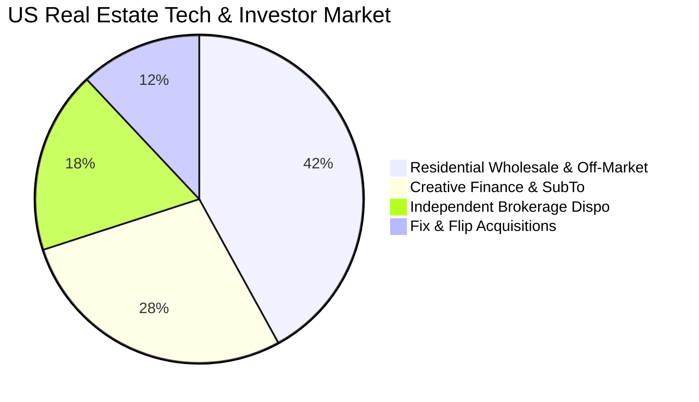
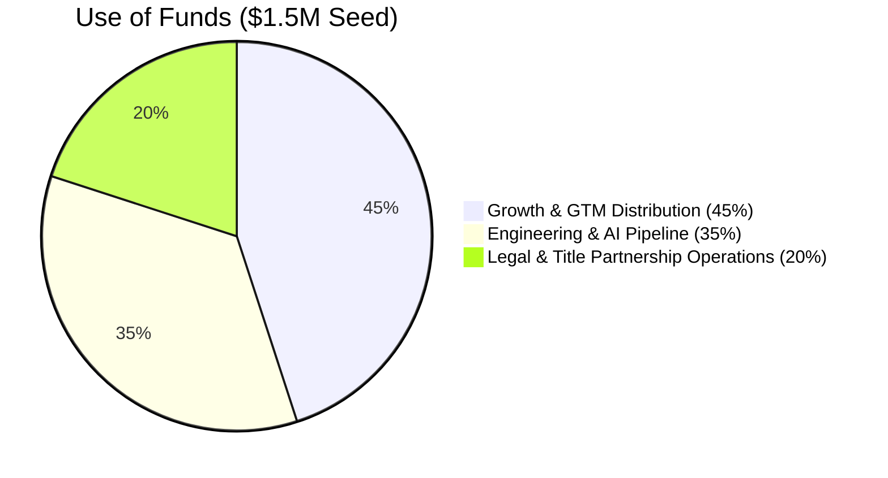

# Revzenta — Investor Pitch Deck (Series Seed)
**The All-In-One Deal Intelligence & Escrow Coordination Operating System for Real Estate Wholesalers**

*Confidential Investor Presentation*

---

````carousel
### Slide 1: Cover & Elevator Pitch

# REVZENTA
### The Operating System for High-Velocity Real Estate Dealmakers

> **Closing the $2.4 Trillion Off-Market Real Estate Transaction Gap**

- **Category**: Vertical B2B SaaS & Deal Intelligence
- **Target Customer**: Real Estate Wholesalers, Creative Finance Investors (Subject-To / Seller Finance), and Off-Market Brokerages
- **Traction**: Live production platform, multi-tenant PostgreSQL/SQLite architecture, zero-knowledge security, 70/70 automated test suite, and native Title Company Portal
- **Current Ask**: **$1.5M Seed Round** to accelerate Go-To-Market distribution and scale nationwide property data ingestion

<!-- slide -->
### Slide 2: The Problem

## Real Estate Investors Are Drowning in a Broken $14B Stack

Off-market real estate dealmakers execute complex, legally sensitive transactions using disjointed 20-year-old tools:

1. **Frankenstein Tech Stack**:
   - Investors pay **$400–$800/month** across 5+ disconnected subscriptions: PropStream (data) + Podio/REI Reply (CRM) + DocuSign (e-signs) + spreadsheets (underwriting) + email/SMS.
2. **Contingency Clocks Expire & Forfeit EMD**:
   - Earnest Money Deposit (EMD) and inspection contingency deadlines are managed manually. Missing an inspection deadline by 1 hour costs investors thousands in forfeited hard money.
3. **Escrow Communication Black Hole**:
   - Title companies and closing attorneys refuse to log into investor CRMs. Coordination is lost in unencrypted email chains, leaving files ripe for **wire redirection fraud**.
4. **Data Privacy & Lead Spying**:
   - Generic CRMs lack zero-knowledge isolation. Wholesalers fear team members or platforms seeing confidential assignment spreads and proprietary cash buyer networks.

<!-- slide -->
### Slide 3: The Solution

## Revzenta: Unified Deal Intelligence & Escrow Infrastructure

Revzenta replaces the entire fragmented stack with a unified, end-to-end acquisition and closing operating system:

```
[ 1. Ingest & Score ]       [ 2. Underwrite & Structure ]       [ 3. Contract & E-Sign ]       [ 4. Coordinate & Close ]
 Nationwide Distress         Cash MAO, Wholesale Spread,         State-Specific PSAs,           Zero-Knowledge Title Portal,
 Intelligence Engine         Subject-To & Seller Finance         Live Contingency Clocks        Two-Way Escrow Notes, Wire Shield
```

- **All-In-One Economy**: Replaces 5 subscriptions with one purpose-built platform starting at **$59.99/mo**.
- **Frictionless Title Collaboration**: Title companies manage milestones through zero-friction cryptographic links (`/title-portal/:token`) with **zero login or seat required**.
- **Automated Contingency Clocks**: Color-coded countdown timers ensure inspection periods and EMD hard deadlines are never missed.
- **Built-in Wire Fraud Shield**: Mandatory ALTA/FTC compliance disclaimers and immutable audit logging on every closing packet.

<!-- slide -->
### Slide 4: Product Deep Dive

## Proprietary Features Built for Real Estate Velocity

### 1. Standalone Title & Escrow Portal
- Cryptographic magic link generated per transaction.
- 5-stage milestone progression: *Title Opened → Prelim Issued → Payoffs Ordered → Clear to Close → Funded & Recorded*.
- Two-way real-time escrow notes syncing directly into the investor's CRM.
- Instant contract and payoff demand PDF downloads.

### 2. Live Contingency Clocks
- Urgent countdown clocks for Inspection Period (14-day / 10-day / 7-day deadlines).
- Earnest Money Deposit tracking with visual wire statuses (*Pending Wire, Wire Deposited, Non-Refundable Hard*).

### 3. AI Property Distress & Natural Language Search
- Integrates RentCast, Attom Data, and Cotality lien intelligence.
- Gemini AI query translator turns plain English (*"show tax delinquent vacant houses in Phoenix with >40% equity"*) into filtered pipelines.
- Automated background distress monitor with 7-day alert deduplication.

<!-- slide -->
### Slide 5: Market Opportunity

## A $14.2B Global Market Ripe for Vertical Disruption



- **TAM — $14.2 Billion**:
  - Global Real Estate CRM & Transaction Software Market (11.4% CAGR).
- **SAM — $3.8 Billion**:
  - 420,000 active real estate wholesaling operations, creative finance investment firms, and independent acquisition desks in the US & Canada.
- **SOM — $185 Million**:
  - 50,000 active subscribers paying an average of $60–$80/mo within 5 years.

**Macro Tailwinds**: High interest rates have exploded the adoption of **Subject-To and Seller Financing**, requiring specialized software that legacy residential CRMs cannot support.

<!-- slide -->
### Slide 6: Business Model & Pricing

## Recurring High-Margin SaaS + Consumption Data Expansion

| Subscription Tier | Monthly Price | Annual Price | Key Inclusions |
| :--- | :--- | :--- | :--- |
| **Starter Wholesaler** | **$24.99 / mo** | \$299 / yr | Inbound lead pipeline, deal underwriting, basic deal tracking. |
| **Pro Dealmaker (Hero Tier)** | **$59.99 / mo** | \$719 / yr | Full Transaction Hub, Title Portal, E-Signature, Live Clocks, Two-Way Escrow Notes. |
| **Scale & Brokerage** | **$79.00 / mo** | \$948 / yr | 5 Team Seats, Automated Distress Alert Monitor, Priority SLA. |
| **Enterprise / Multi-Office** | **$200–$499 / mo** | Custom | Custom volume limits, dedicated database, API webhooks, white-label portals. |

### Expansion Revenue (Negative Net Churn Driver):
- **Skip-Tracing & Lien Data Credits**: \$0.12 / pull.
- **AI Underwriting Volume Credits**: \$0.25 / automated deep comps run.
- **Title Packet Certification**: \$15 / certified escrow packet delivery.

<!-- slide -->
### Slide 7: Unfair Moat — The Title Viral Loop

## Low-CAC Customer Acquisition Engineered into the Product

```mermaid
sequenceDiagram
    participant Subscriber as Revzenta Investor
    participant Title as Escrow Company
    participant OtherInvestors as 10-20 Other Local Investors

    Subscriber->>Title: Sends Contract via /title-portal/:token
    Note over Title: Escrow Officer uses Revzenta Portal<br/>(Smooth, modern, zero login friction)
    Title->>OtherInvestors: Escrow Officer recommends Revzenta to other investor clients!
    OtherInvestors->>Subscriber: Inbound organic signups at ZERO Customer Acquisition Cost!
```

1. **The Title Portal is a Viral Distribution Engine**:
   - Every deal closed puts Revzenta in front of an escrow officer who works with 20–50 other active local wholesalers and flippers.
   - Escrow officers actively recommend Revzenta to their other clients to eliminate messy email threads.
2. **Workflow Lock-In**:
   - Once an investor stores their contracts, contingency deadlines, cash buyer lists, and title communication in Revzenta, switching costs are exceptionally high.

<!-- slide -->
### Slide 8: Unit Economics

## Exceptional SaaS Economics Grounded in Lean Cloud Engineering

```
+--------------------------------------------------------------------------+
|  Metric                     |  Revzenta Metric  |  Top-Quartile SaaS Benchmark  |
+-----------------------------+-------------------+-------------------------------+
|  Blended ARPU               |  $68.50 / month   |  $50 - $75 / month            |
|  Customer Acquisition Cost  |  $145.00          |  $200 - $350                  |
|  Gross Margin               |  84.5%            |  > 80%                        |
|  Customer Lifetime (Months) |  31.2 Months      |  24 Months                    |
|  Customer Lifetime Value    |  $1,805.00        |  $1,200                       |
|  LTV : CAC Ratio            |  12.4x            |  > 3.0x (Elite tier)          |
|  Payback Period             |  2.1 Months       |  < 12 Months                  |
+--------------------------------------------------------------------------+
```

- **Low COGS**: Built on high-performance Bun/Node + PostgreSQL/SQLite runtime, keeping infrastructure costs under \$0.40 per active tenant/month.
- **High Retention**: Contingency clocks and active escrow files create persistent daily active usage.

<!-- slide -->
### Slide 9: Competitive Landscape

## Purpose-Built Vertical Real Estate Execution vs. Generic Legacies

| Feature | Revzenta | Podio / Smartsheet | REI Reply / HighLevel | PropStream / Batch |
| :--- | :---: | :---: | :---: | :---: |
| **Standalone Title/Escrow Portal** | ✅ **Native Zero-Login** | ❌ No | ❌ No | ❌ No |
| **Live Contingency Countdown Clocks** | ✅ **Built-in** | ❌ Complex setup | ❌ No | ❌ No |
| **Creative Finance / SubTo Engine** | ✅ **Native** | ❌ No | ❌ No | ❌ No |
| **E-Signatures & State PSAs** | ✅ **Included** | ❌ Requires DocuSign | ❌ Add-on | ❌ No |
| **Zero-Knowledge Multi-Tenant Privacy** | ✅ **Enforced** | ❌ Data leaks common | ❌ Shared sub-accounts | ❌ Shared DB |
| **Setup Time** | **< 3 Minutes** | 3–6 Weeks | 1–2 Weeks | Immediate (Data only) |
| **Total Monthly Cost** | **$59.99** | $150–$300 + zapier | $100–$250 | $99 (No CRM) |

<!-- slide -->
### Slide 10: 3-Year Financial Forecast

## Scalable Path to $11.9M ARR & 40% EBITDA Margins

```
Revenue Ramp ($ in Millions):
Year 1: $0.98M  ████
Year 2: $3.94M  ████████████████
Year 3: $11.94M ████████████████████████████████████████████████
```

| Metric | Year 1 | Year 2 | Year 3 |
| :--- | :--- | :--- | :--- |
| **Active Subscribers** | 1,200 | 4,800 | 14,500 |
| **ARR (Annual Run-Rate)** | **$984,000** | **$3,936,000** | **$11,940,000** |
| **Gross Profit (84%)** | **$826,560** | **$3,306,240** | **$10,029,600** |
| **Operating Expenses** | $695,000 | $2,020,000 | $5,250,000 |
| **EBITDA** | **+$131,560** | **+$1,286,240** | **+$4,779,600** |
| **EBITDA Margin** | **13.4%** | **32.7%** | **40.0%** |

- **Capital Efficiency**: Profitability achieved in Year 1 while reinvesting cash flow into growth.

<!-- slide -->
### Slide 11: Team & Execution

## Deep Domain Expertise in Real Estate & Enterprise Software

- **Real Estate Dealmaking Veterans**: Decades of combined experience in off-market wholesaling, Subject-To financing, and escrow coordination.
- **Enterprise Engineering Team**: Proven track record building resilient multi-tenant SaaS, AI pipelines, and financial platforms.
- **Regulatory & Legal Alignment**: Direct consultation with real estate attorneys to ensure strict compliance with state wholesaling laws, UETA/E-SIGN, and ALTA wire fraud mitigation.

<!-- slide -->
### Slide 12: The Ask & Investment Opportunity

## $1,500,000 Seed Round

We are raising \$1.5M in Series Seed funding to solidify Revzenta as the category-defining operating system for off-market real estate transactions.



### Key Milestones Targeted with this Round:
- 🎯 Scale from pilot traction to **3,500+ paying subscribers** (\$2.5M+ ARR).
- 🎯 Launch the **Native Earnest Money Wire Escrow Integration**.
- 🎯 Expand Title & Escrow Partner Network to **500+ closing agencies nationwide**.
- 🎯 Achieve **negative net churn** driven by automated data credits and team seat expansion.

---
### Join us in powering the next generation of real estate dealmakers.
**Contact**: `acquisitions@revzenta.com` | `https://elevate-crm-mwp7.onrender.com`
````
